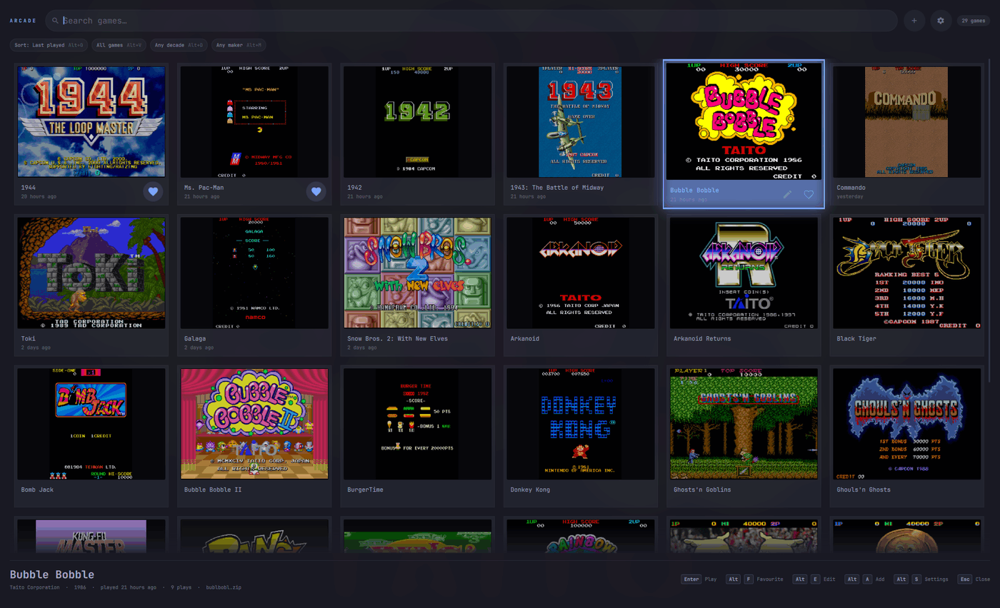

# Arcade

**TL;DR:** an Omarchy overlay that shows your arcade games as a wall of title screens and plays the one you pick in RetroArch.



- **Plugin ID:** `io.github.kimm-stensborg.arcade` · **Kind:** overlay · **License:** MIT
- **Requires:** Omarchy 4 (Quattro), RetroArch with FinalBurn Neo or MAME

## What it does

- **Wall of title screens** with real names, sorted by last played, favourites, most played, name or year
- **Search and filters:** type to search; filter by favourites, played, decade, maker, genre and players
- **Every game FinalBurn Neo knows:** browse all ~2,750 arcade games, yours and the rest, and keep a wishlist
- **Favourites** marked with a heart
- **Versions** of a game share one tile; `Tab` picks one
- **Each game's own settings:** name, artwork, shader, smoothing, shape, scaling, rotation, controls
- **Add games** from a file chooser or by dropping romsets on the panel; each is test-played first
- **Check the library** to mark games that won't start, with the reason
- **Attract mode** cycles title screens when the panel is left alone
- **The game waits** while the arcade is open, and `Enter` puts you back in it
- **Continue where you left off:** per game, RetroArch saves its state as it closes and picks it up next time
- **Stick support:** Home opens the arcade and returns from a game

## Install

```bash
omarchy plugin add https://github.com/kimm-stensborg/omarchy-arcade.git
~/.config/omarchy/plugins/io.github.kimm-stensborg.arcade/install.sh
```

`install.sh` binds a shortcut (`SUPER + A` by default), adds window rules for low-latency play, and enables the plugin.

```bash
install.sh --key "SUPER + F12"   # choose the shortcut
install.sh --no-bind             # enable only
./uninstall.sh [--purge]         # remove the shortcut and links
```

| Package | For |
| --- | --- |
| `retroarch` | playing |
| `libretro-fbneo-git` or `libretro-mame` | the arcade core |
| `libretro-database-git` | game titles |
| `python` | reading the databases, fetching artwork |
| `zenity` | the file chooser (optional) |

Romsets go in `~/Games/roms`.

## Keys

| Key | Does |
| --- | --- |
| type | search |
| arrows, `PgUp` `PgDn`, `Home` `End` | move |
| `Enter` | play (or return to the running game) |
| `Tab` | next version of the game |
| `Alt+F` | favourite |
| `Alt+O` | sort |
| `Alt+V` `Alt+D` `Alt+M` `Alt+G` `Alt+P` | filter: show, decade, maker, genre, players |
| `Alt+0` | clear filters |
| `Alt+E` | this game's settings |
| `Alt+A` | add games |
| `Alt+S` | settings |
| `F5` | rescan |
| `Esc` | close |

`Shift` steps sort and filters backwards.

## Stick

| Button | Does |
| --- | --- |
| Home | open the arcade; in a game, close it and open the arcade |
| lever | move |
| B, Start | play |
| A | back |
| Y, X | previous / next version |
| L, R | page up / down |
| ZL, ZR | favourite |
| L3, R3 | sort / show |
| Minus | settings |

Any controller RetroArch has a profile for works. **Settings › Test the stick** shows what each button does in a game.

## Settings

`Alt+S` opens them. They live in `~/.config/omarchy/arcade.conf` ([example](share/arcade.conf.example)).

| Setting | Default |
| --- | --- |
| `ROM_DIR` | `~/Games/roms` |
| `ROM_EXTS` | `zip 7z chd` |
| `CORE_PATH` | FBNeo, then MAME |
| `RETROARCH_CONFIG` | your RetroArch config |
| `ARTWORK` | `on` |
| `ART_KINDS` | `titles snaps boxarts` |
| `TILE_SIZE` | `300` px |
| `MAX_COLUMNS` | `6` |
| `SORT_BY` | `last played` |
| `GROUP_VERSIONS` | `on` |
| `ATTRACT_AFTER` | `60` seconds (`off` to disable) |

**Controls:** pick MAME standard (coin `5`, start `1`, `Ctrl` `Alt` `Space`...) or RetroArch's layout, or bind each control by pressing the key.

**A game's own settings** (`Alt+E`) — name, continue, artwork, picture, controls — are saved in `~/.config/omarchy/arcade-games/<rom>.cfg` and apply to that game only.

## Command line

```bash
arcade-launcher bublbobl            # play a game
arcade-launcher --list [--all]      # your games [and every FBNeo game]
arcade-launcher --add pang.zip      # add a romset
arcade-launcher --check             # find games that won't start
arcade-launcher --playing           # "playing" or "paused"
arcade-launcher --favourite galaga  # favourite a game
arcade-launcher --game-set sf2 SHADER=crt/crt-royale.slangp
arcade-launcher --doctor            # check the setup
arcade-launcher --help              # everything else
```

The launcher also runs on plain Hyprland: see [`hypr/`](hypr) and [`udev/`](udev).

## Files

| Path | Holds |
| --- | --- |
| `Arcade.qml` + `*.qml` | the panel and its views |
| `Library.js` `Browse.js` `Present.js` `Settings.js` `Controls.js` `Pad.js` | the panel's logic, tested by `node test.js` |
| `bin/arcade-launcher` + `lib/launcher/` | lists, launches, adds and checks games; tested by `./test-launcher.sh` |
| `bin/arcade-artwork` | fetches title screens |
| `bin/arcade-pad` | follows the stick |
| `bin/arcade-rdb-dump` | reads the libretro databases |
| `share/arcade-gameinfo.tsv` | every FBNeo game's genre, players, screen and parent set (`tools/make-gameinfo.py`) |
| `share/arcade-titles.tsv` | title overrides |
